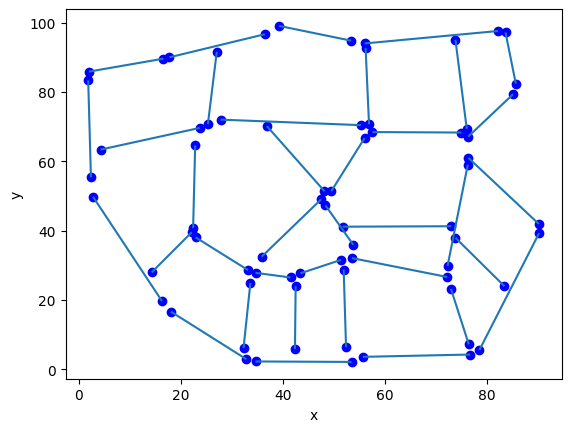
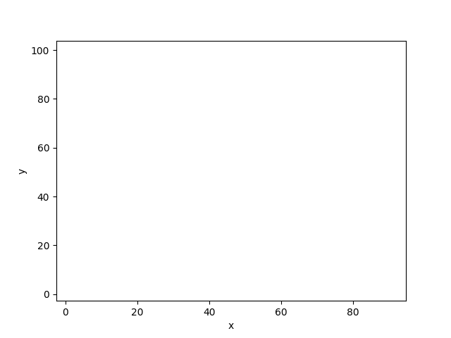
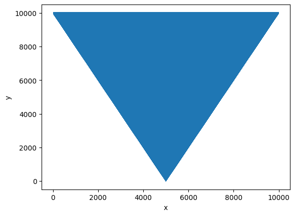

# Trapezoidal Map for Point Location

A Python implementation of the trapezoidal map data structure for efficient point location in planar subdivisions. 

## About
This project was developed in collaboration with [@vimzoomer](https://github.com/vimzoomer) who implemented:
- Visualization system
- Multiple trapezoids splitting algorithm
- Managing project structure
- Writing performance tests

## Features
- Constructs trapezoidal maps from non-intersecting line segments
- O(log n) expected time point location queries
- Interactive visualizations
- Step-by-step algorithm demonstration

## Use Cases
- **GIS Systems**: Locating points in geographic regions
- **CAD Software**: Point-in-polygon tests

## Example Input




## Example performance test (10000 segments)


## Tech Stack
- **Python 3**
- **[Visualizer made by KN BIT](https://github.com/aghbit/Algorytmy-Geometryczne/tree/master/bitalg/visualizer)** for visualization
- **Jupyter Notebook** for interactive demos

## Installation
```bash
git clone https://github.com/yourusername/trapezoidal-map.git
cd trapezoidal-map
pip install -r requirements.txt